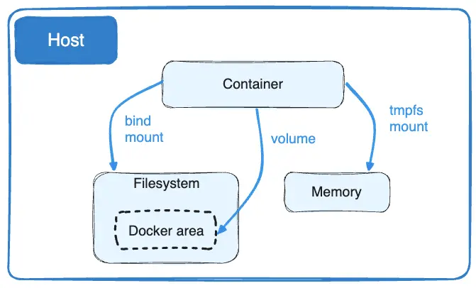

# Docker

> Notes on docker. Build out effort in [learning_plan_v2]() and [completed-learning-tasks.md]()

- [Docker](#docker)
  - [Usage](#usage)
    - [Usage - CLI Examples](#usage---cli-examples)
    - [Usage Developer Notes](#usage-developer-notes)
  - [Reference](#reference)
    - [Reference - Compose](#reference---compose)
    - [Reference - Volumes](#reference---volumes)
      - [Volumes - Mounting Error](#volumes---mounting-error)
    - [Reference - Build Args](#reference---build-args)
      - [Build - Args - CMD and ENTRYPOINT](#build---args---cmd-and-entrypoint)
    - [Reference - Build Stages](#reference---build-stages)
    - [Reference - Network](#reference---network)
      - [Internal Network DNS](#internal-network-dns)
    - [Reference - Daemon management](#reference---daemon-management)
      - [Daemon management - Rancher](#daemon-management---rancher)
      - [Daemon management - Logging drivers](#daemon-management---logging-drivers)
      - [Daemon management - Plugins](#daemon-management---plugins)
    - [Reference - Misc Info](#reference---misc-info)
      - [Other](#other)
      - [Context](#context)
      - [CID file](#cid-file)
      - [Environment Variables Examples](#environment-variables-examples)

## Usage

### Usage - CLI Examples

- Remember you can pass startup command via cli `docker run -i -t ubuntu /bin/bash`

- `docker container stats`
- `docker run -dp 127.0.0.1:3000:3000 getting-started`
  - 127.0.0.1 is `localhost` allowing localhost:3000 to be accessible
- `docker run -dp 127.0.0.1:3000:3000 --mount type=volume,src=todo-db,target=/etc/todos getting-started` -> Explicit volume mounting:
- set Environment Variables

  - `docker run -e foo=bar postgres env`
  - `docker run --env-file .env postgres env`

- `docker container commit -c "CMD node app.js" -m "Add app" app-container sample-app`

  - "run the following command to save this container’s changes as a new image"
  - https://docs.docker.com/guides/docker-concepts/building-images/understanding-image-layers/#build-an-app-image

- `exec` flag can run a command in the container without attaching to it

- `docker compose down --volumes` -> remove volumes when running compose down
- `docker compose logs -f` command. You'll see the logs from each of the services interleaved into a single stream.
- `--progress=plain` sort of nice applies to build command only

- `docker compose run --build ServiceName dotnet test /source/tests`

  - run a command in a compose service on startup

- `docker build --output=bin --target=binaries .`

  - export things to your local machine

- `docker image prune -a --filter "until=24h"`

  - Prune over a time frame

- `docker exec`

  > The command must be an executable. A chained or a quoted command doesn't work.

  - This works: docker exec -it my_container sh -c "echo a && echo b"
  - This doesn't work: docker exec -it my_container "echo a && echo b"
  - You can also set a working directory for the command
  - https://docs.docker.com/reference/dockerfile/#understand-how-cmd-and-entrypoint-interact

- `docker run -d ubuntu` get a clean ub container

### Usage Developer Notes

## Reference

### Reference - Compose

> The docker compose run command is for running "one-off" or "adhoc" tasks. It requires the service name you want to run and only starts containers for services that the running service depends on. Use run to run tests or perform an administrative task such as removing or adding data to a data volume container. The run command acts like docker run -ti in that it opens an interactive terminal to the container and returns an exit status matching the exit status of the process in the container.

> By default, Compose reads two files, a compose.yml and an optional compose.override.yml file.
> Compose merges files in the order they're specified on the command line. Subsequent files may merge, override, or add to their predecessors.

- Watch Mode https://docs.docker.com/language/dotnet/develop/#automatically-update-services

### Reference - Volumes

- types:
  - `--mount type=volume` contains files within a docker volume used across containers; not accessible to host
  - `--mount type=bind` Allows usage of host file system
    - Bind mounts are good fo local development; see https://docs.docker.com/get-started/06_bind_mounts/#run-your-app-in-a-development-container
    - Combine with nodemon

> "Volumes are created and managed by Docker."
>
> "When you use a bind mount, a file or directory on the host machine is mounted into a container. "
>
> " tmpfs mount isn't persisted on disk, either on the Docker host or within a container. It can be used by a container during the lifetime of the container, to store non-persistent state or sensitive information" --_This is a security risk_



> If you use -v or --volume to bind-mount a file or directory that does not yet exist on the Docker host, -v creates the endpoint for you. It is always created as a directory. If you use --mount to bind-mount a file or directory that does not yet exist on the Docker host, Docker does not automatically create it for you, but generates an error.

#### Volumes - Mounting Error

> git bash and absolute paths processing in windows PWD causes issues

**Powershell:**
`docker run -dp 127.0.0.1:3000:3000 --mount type=volume,src=todo-db,target=/etc/todos getting-started`

**Git Bash:**
`docker run -dp 127.0.0.1:3000:3000 --mount type=volume,src=todo-db,target=//etc/todos getting-started`

> The following is a common syntax in examples

```bash
docker run -dp-v ${PWD}:/app
```

> Error

```bash
docker: Error response from daemon: the working directory 'C:/Program Files/Git/app' is invalid, it needs to be an absolute path.
See 'docker run --help'.
```

  <!-- -- mount is a better flag than -v for this sort of thing -->

> PWD

```bash
//c/Users/Y891986/Documents/GitHub/docker-lab/vsc-tutorial/getting-started-master
```

> use Docker Compose as an alternative setup

- Handle `$(pwd)`
  docker run -it --mount type=bind,src="$(pwd)",target=/src ubuntu bash

---

### Reference - Build Args

- https://docs.docker.com/build/guide/build-args/
- Note that build ARGS are [scoped to their stage](https://docs.docker.com/build/building/variables/#build-arguments)

> set version of an image _or anything_ via args

```dockerfile
# syntax=docker/dockerfile:1
# default value is 1.21
ARG GO_VERSION=1.21
# version of golang is passed as an arg
FROM golang:${GO_VERSION}-alpine AS base
```

#### Build - Args - CMD and ENTRYPOINT

> `docker run [OPTIONS] IMAGE[:TAG|@DIGEST] [COMMAND] [ARG...]`

- CMD in the docker file and COMMAND control startup commands
- ENTRYPOINT is ~~where they run~~ the binary to run on startup
  - > The ENTRYPOINT defines a container's default behavior, with the idea that when you set an entrypoint you can run the container as if it were that binary.

### Reference - Build Stages

- Allows to build a .dll or executable but not ship the build tool as part of the image
- Stages can be executed in parallel allowing [multiple builds at once](https://docs.docker.com/build/guide/multi-stage/)

> Example build the react app then put in an nginx image

```dockerfile
#  Build React Image
FROM node:20-alpine AS build
WORKDIR /app
COPY package* yarn.lock ./
RUN yarn install
COPY public ./public
COPY src ./src
RUN yarn run build

#  Copy into an nginx Image
FROM nginx:alpine
COPY --from=build /app/build /usr/share/nginx/html
```

### Reference - Network

> Linked containers on the default bridge network share environment variables.

#### Internal Network DNS

- Will resolve DNS to container name which is the service name in the docker-compose file

### Reference - Daemon management

#### Daemon management - Rancher

- run `wsl -v`
- connect to rancher-desktop `wsl -d rancher-desktop`

> utilize the `docker context` command to see things about the [daemon](https://docs.docker.com/engine/context/working-with-contexts/)

- `docker info` is effectively docker daemon config
  - docker info --format '{{.LoggingDriver}}' _useful_

#### Daemon management - Logging drivers

- docker info --format '{{.LoggingDriver}}' _useful_
  - for container use `inpsect`
- No logging: `docker run -it --log-driver none alpine ash`

#### Daemon management - Plugins

> Plugins sit between client and daemon client --> plugin --> daemon

### Reference - Misc Info

#### Other

- useful --> 🗒️ try https://docs.docker.com/config/containers/start-containers-automatically/

#### Context

> Context is the file system available to docker commands

- You can use remote URLs (git repos) for this https://docs.docker.com/build/building/context/#git-repositories

#### CID file

- `docker run --cidfile FILE_PATH` https://docs.docker.com/reference/cli/docker/container/run/#cidfile

#### Environment Variables Examples

```bash
export today=Wednesday
docker run -e "deep=purple" -e today --rm alpine env

PATH=/usr/local/sbin:/usr/local/bin:/usr/sbin:/usr/bin:/sbin:/bin
HOSTNAME=d2219b854598
deep=purple
today=Wednesday
HOME=/root
```
