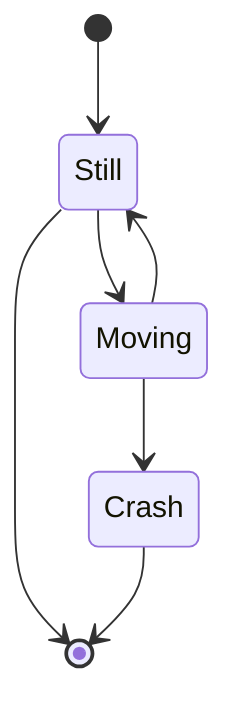
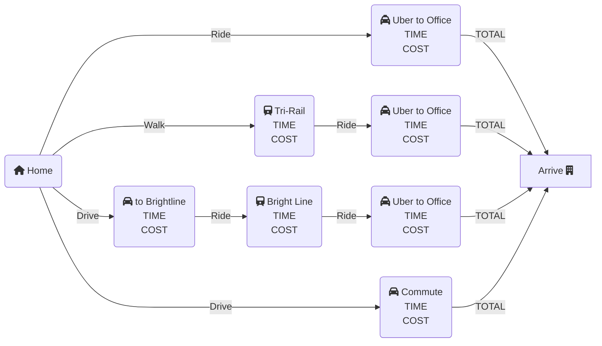
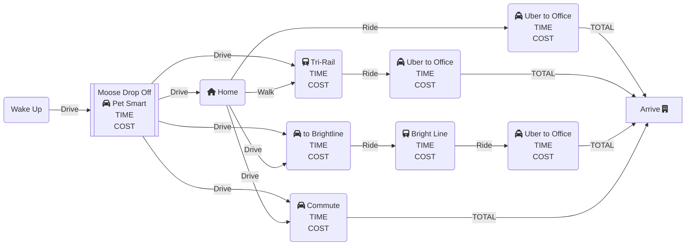

# Mermaid -> Demo Space

```mermaid
stateDiagram-v2
    [*] --> Still
    Still --> [*]
    Still --> Moving
    Moving --> Still
    Moving --> Crash
    Crash --> [*]
```

## Commute

- [ ] Task -> 🗒️ implement as subgraph
- [ ] Task -> 🗒️ find cost of dog walker

### Without Moose Drop Off

```mermaid

flowchart LR
    A("fa:fa-house Home ") -- Drive --> D1("fa:fa-car Commute   <br>TIME<br>COST") & D2("fa:fa-car to Brightline   <br>TIME<br>COST")
    A -- Ride --> R1("fa:fa-taxi Uber to Office  <br>TIME<br>COST")
    A -- Walk --> T1("fa:fa-train Tri-Rail  <br>TIME<br>COST")
    D2 -- Ride --> T2("fa:fa-train Bright Line  <br>TIME<br>COST")
    T1 -- Ride --> R2("fa:fa-taxi Uber to Office   <br>TIME<br>COST")
    T2 -- Ride --> R3("fa:fa-taxi Uber to Office   <br>TIME<br>COST")
    R1 -- TOTAL --> O1["Arrive fa:fa-building"]
    R2 -- TOTAL --> O1
    R3 -- TOTAL --> O1
    D1 -- TOTAL --> O1


```

### With Moose Drop Off

```mermaid

flowchart LR

    W1("Wake Up") --Drive--> subId
    subId --Drive--> A
    subId --Drive--> D2
    subId --Drive--> T1
    subId --Drive--> D1

    subId[["`Moose Drop Off <br> fa:fa-car Pet Smart   <br>TIME<br>COST`"]]

    A("fa:fa-house Home ") -- Drive --> D1("fa:fa-car Commute   <br>TIME<br>COST") & D2("fa:fa-car to Brightline   <br>TIME<br>COST")
    A -- Ride --> R1("fa:fa-taxi Uber to Office  <br>TIME<br>COST")
    A -- Walk --> T1("fa:fa-train Tri-Rail  <br>TIME<br>COST")
    D2 -- Ride --> T2("fa:fa-train Bright Line  <br>TIME<br>COST")
    T1 -- Ride --> R2("fa:fa-taxi Uber to Office   <br>TIME<br>COST")
    T2 -- Ride --> R3("fa:fa-taxi Uber to Office   <br>TIME<br>COST")
    R1 -- TOTAL --> O1["Arrive fa:fa-building"]
    R2 -- TOTAL --> O1
    R3 -- TOTAL --> O1
    D1 -- TOTAL --> O1


```
