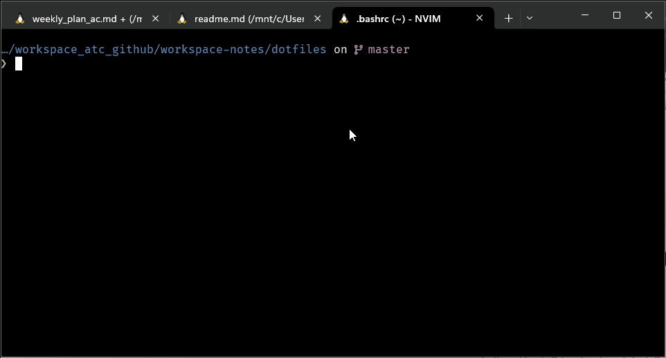
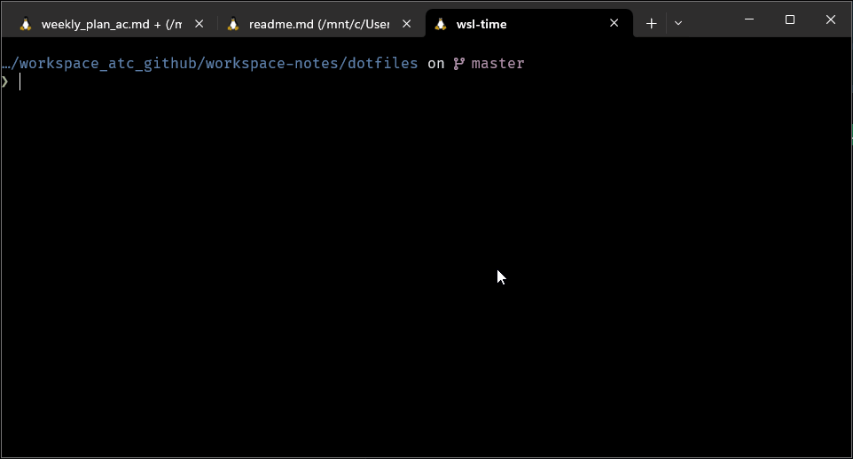

# Setup

> These are dotfiles I use for my personal development environment. Heavily inspired by the following
> Suggestions are welcome

- https://github.com/hendrikmi/dotfiles
- https://github.com/linkarzu/dotfiles-latest
- https://github.com/omerxx/dotfiles/tree/master/zshrc

## Demo

### CLI Demo


### Neovim Demo


## Install Linux Dependencies

> UNDER DEVELOPMENT

```bash
## Eventually this will be configured in  ./install.sh

sudo apt install bat btop cargo cmatrix fd-find stow tree gh

npm install -g tldr
# something broke here
git clone --depth 1 https://github.com/junegunn/fzf.git ~/.fzf
~/.fzf/install

curl -sS https://starship.rs/install.sh | sh

# EXA
sudo apt install cargo
cargo install exa

```

## Setup Dotfiles

> From the top folder of this repo run the following command. This creates symlinks from the dotfiles repo location
> to your home directory. Files can be edited and managed with git.

```bash
# sudo install stow if not present
cd ..
stow -t ~/.config ./
```

> Add the following to `~/.bashrc` for quick setup.

```bash
# Source all files in ~/.config/bash_config if the directory exists
if [ -d "$HOME/.config/bash_config" ]; then
    for file in "$HOME/.config/bash_config"/*.sh; do
        if [ -f "$file" ]; then
            source "$file"
        fi
    done
fi

```

1. Rerun `stow -t ~/.config ./` if any new files are added/removed
2. Run `source ~/.bashrc` or `sbb` to update Bash config after editing a file

## Neovim

> These dotfiles include 4 distros that are used for testing and experiments.
> ./nvim-astro is the primary configuration used

[AstroNvim](https://astronvim.com/)

<a href="https://dotfyle.com/acudworth3/dotfiles-nvim-astro"></a>
<a href="https://dotfyle.com/acudworth3/dotfiles-nvim-astro"></a>
<a href="https://dotfyle.com/acudworth3/dotfiles-nvim-astro"></a>

<details>
<summary>Setup Instructions</summary>

### dotfiles/nvim-astro

Add the following to `.bashrc for best results`

```bash
alias nvim="NVIM_APPNAME=nvim-astro nvim"
export EDITOR="NVIM_APPNAME=nvim-astro nvim"
```

#### Install Instructions

> Install requires Neovim 0.9+. Always review the code before installing a configuration.

Clone the repository and install the plugins:

```sh
git clone git@github.com:acudworth3/dotfiles/nvim-astro ~/.config/acudworth3/dotfiles/nvim-astro
```

Open Neovim with this config:

```sh
NVIM_APPNAME=acudworth3/dotfiles/nvim-astro nvim
```

#### Plugins

##### editing-support

- [windwp/nvim-autopairs](https://dotfyle.com/plugins/windwp/nvim-autopairs)
- [ptdewey/yankbank-nvim](https://dotfyle.com/plugins/ptdewey/yankbank-nvim)

##### git

- [linrongbin16/gitlinker.nvim](https://dotfyle.com/plugins/linrongbin16/gitlinker.nvim)

##### keybinding

- [max397574/better-escape.nvim](https://dotfyle.com/plugins/max397574/better-escape.nvim)

##### lsp

- [ray-x/lsp_signature.nvim](https://dotfyle.com/plugins/ray-x/lsp_signature.nvim)
- [nvimtools/none-ls.nvim](https://dotfyle.com/plugins/nvimtools/none-ls.nvim)

##### media

- [andweeb/presence.nvim](https://dotfyle.com/plugins/andweeb/presence.nvim)

##### motion

- [gen740/SmoothCursor.nvim](https://dotfyle.com/plugins/gen740/SmoothCursor.nvim)

##### nvim-dev

- [kkharji/sqlite.lua](https://dotfyle.com/plugins/kkharji/sqlite.lua)

##### plugin-manager

- [folke/lazy.nvim](https://dotfyle.com/plugins/folke/lazy.nvim)

##### preconfigured

- [AstroNvim/AstroNvim](https://dotfyle.com/plugins/AstroNvim/AstroNvim)

##### snippet

- [L3MON4D3/LuaSnip](https://dotfyle.com/plugins/L3MON4D3/LuaSnip)

##### startup

- [goolord/alpha-nvim](https://dotfyle.com/plugins/goolord/alpha-nvim)

##### syntax

- [nvim-treesitter/nvim-treesitter](https://dotfyle.com/plugins/nvim-treesitter/nvim-treesitter)
- [kylechui/nvim-surround](https://dotfyle.com/plugins/kylechui/nvim-surround)

##### terminal-integration

- [samjwill/nvim-unception](https://dotfyle.com/plugins/samjwill/nvim-unception)

#### Language Servers

- bashls
- dockerls
- eslint
- html
- jsonls
- lua_ls
- marksman
- pyright
- yamlls

This readme was generated by [Dotfyle](https://dotfyle.com)

</details>

## Tool Examples

> Things I think are neat
> /TODO add a collapse here

### exa

### atuin

> use [Atuin](https://github.com/atuinsh/atuin) to view all previous commands

- `CTRL+ r` to view command list
- `TAB` to play in cli without executing
- `enter` to execute

<details>
<summary>atuin demo</summary>


</details>

### tldr

### batcat

> [batcat](https://www.cyberciti.biz/open-source/bat-linux-command-a-cat-clone-with-written-in-rust/) provides an alternative to cat with navigable previews

```bash
alias cat='batcat'
alias bat='batcat'
```

- scroll through the preview with `j` `k` and `CTRL+d` `CTRL+u`
- `q` to exit the preview

<details>
<summary>batcat demo</summary>



</details>

### yazi

> [yazi](https://github.com/sxyazi/yazi) is a TUI file explorer

- use `h` and `l` to move up or down 1 folder level
- use `j` and `k` to move up and down the file list
- use `~` to view all options
- search with `f`
<details>
<summary>yazi demo</summary>



</details>

### lazygit

### lazydocker
