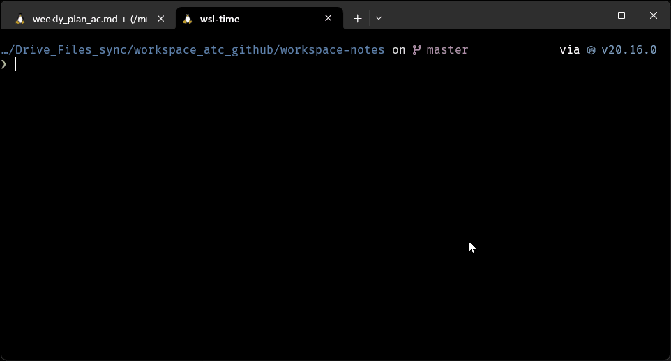
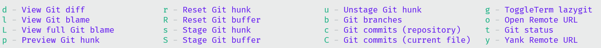

# Setup

> These are dotfiles I use for my personal development environment. Heavily inspired by the following
> Suggestions are welcome

- https://github.com/hendrikmi/dotfiles
- https://github.com/linkarzu/dotfiles-latest
- https://github.com/omerxx/dotfiles/tree/master/zshrc

## Demo

### CLI Demo


### Neovim Demo


## Install Linux Dependencies

> The `install.sh` script will run the following to covering most tools in these dotfiles

1. Call `./install.sh` after making it executable `chmod +x install.sh`

```bash
## Latest setup is configured in  ./install.sh

sudo apt install bat btop cargo cmatrix fd-find stow tree gh pv

# something broke here
git clone --depth 1 https://github.com/junegunn/fzf.git ~/.fzf
~/.fzf/install

curl -sS https://starship.rs/install.sh | sh

# EXA
sudo apt install cargo
cargo install exa
cargo install tokei
sudo snap install jqp

```

## Setup Dotfiles

> From the top folder of this repo run the following command. This creates symlinks from the dotfiles repo location
> to your home directory. Files can be edited and managed with git.

- Once you've done this, you can edit the dot files in your clone of this repo, source bash (run `sbb`) and immediately have the changed available

```bash
# sudo install stow if not present
cd ..
stow -t ~/.config ./
```

> Add the following to `~/.bashrc` for quick setup.

```bash
# Source all files in ~/.config/bash_config if the directory exists
if [ -d "$HOME/.config/bash_config" ]; then
    for file in "$HOME/.config/bash_config"/*.sh; do
        if [ -f "$file" ]; then
            source "$file"
        fi
    done
fi

```

1. Rerun `stow -t ~/.config ./` if any new files are added/removed
2. Run `source ~/.bashrc` or `sbb` to update Bash config after editing a file

## Neovim

<a href="https://dotfyle.com/acudworth3/dotfiles-nvim-astro"></a>
<a href="https://dotfyle.com/acudworth3/dotfiles-nvim-astro"></a>
<a href="https://dotfyle.com/acudworth3/dotfiles-nvim-astro"></a>

<details>

<summary>Plugin Overview</summary>

> [!IMPORTANT]
> You do nto need to do this if you cloned the dotfiles and and ran the stow commands. This would be to install _only_ neovim from this repo

### Install Instructions

> Install requires Neovim 0.9+. Always review the code before installing a configuration.

Clone the repository and install the plugins:

```sh
git clone git@github.com:acudworth3/dotfiles ~/.config/acudworth3/dotfiles
```

Open Neovim with this config:

```sh
NVIM_APPNAME=acudworth3/dotfiles/nvim-astro nvim
```

### Plugins

#### completion

- [hrsh7th/nvim-cmp](https://dotfyle.com/plugins/hrsh7th/nvim-cmp)

#### editing-support

- [windwp/nvim-autopairs](https://dotfyle.com/plugins/windwp/nvim-autopairs)
- [johmsalas/text-case.nvim](https://dotfyle.com/plugins/johmsalas/text-case.nvim)
- [ptdewey/yankbank-nvim](https://dotfyle.com/plugins/ptdewey/yankbank-nvim)

#### file-explorer

- [mikavilpas/yazi.nvim](https://dotfyle.com/plugins/mikavilpas/yazi.nvim)
- [nvim-neo-tree/neo-tree.nvim](https://dotfyle.com/plugins/nvim-neo-tree/neo-tree.nvim)

#### fun

- [tamton-aquib/duck.nvim](https://dotfyle.com/plugins/tamton-aquib/duck.nvim)

#### fuzzy-finder

- [nvim-telescope/telescope.nvim](https://dotfyle.com/plugins/nvim-telescope/telescope.nvim)

#### git

- [linrongbin16/gitlinker.nvim](https://dotfyle.com/plugins/linrongbin16/gitlinker.nvim)

#### keybinding

- [mrjones2014/legendary.nvim](https://dotfyle.com/plugins/mrjones2014/legendary.nvim)
- [max397574/better-escape.nvim](https://dotfyle.com/plugins/max397574/better-escape.nvim)

#### lsp

- [ray-x/lsp_signature.nvim](https://dotfyle.com/plugins/ray-x/lsp_signature.nvim)
- [nvimtools/none-ls.nvim](https://dotfyle.com/plugins/nvimtools/none-ls.nvim)

#### markdown-and-latex

- [iamcco/markdown-preview.nvim](https://dotfyle.com/plugins/iamcco/markdown-preview.nvim)
- [nfrid/markdown-togglecheck](https://dotfyle.com/plugins/nfrid/markdown-togglecheck)

#### motion

- [folke/flash.nvim](https://dotfyle.com/plugins/folke/flash.nvim)
- [gen740/SmoothCursor.nvim](https://dotfyle.com/plugins/gen740/SmoothCursor.nvim)

#### nvim-dev

- [nvim-lua/plenary.nvim](https://dotfyle.com/plugins/nvim-lua/plenary.nvim)
- [kkharji/sqlite.lua](https://dotfyle.com/plugins/kkharji/sqlite.lua)
- [MunifTanjim/nui.nvim](https://dotfyle.com/plugins/MunifTanjim/nui.nvim)

#### plugin-manager

- [folke/lazy.nvim](https://dotfyle.com/plugins/folke/lazy.nvim)

#### preconfigured

- [AstroNvim/AstroNvim](https://dotfyle.com/plugins/AstroNvim/AstroNvim)

#### programming-languages-support

- [MoaidHathot/dotnet.nvim](https://dotfyle.com/plugins/MoaidHathot/dotnet.nvim)
- [GustavEikaas/easy-dotnet.nvim](https://dotfyle.com/plugins/GustavEikaas/easy-dotnet.nvim)

#### scrolling

- [rlychrisg/keepcursor.nvim](https://dotfyle.com/plugins/rlychrisg/keepcursor.nvim)

#### search

- [nvim-pack/nvim-spectre](https://dotfyle.com/plugins/nvim-pack/nvim-spectre)

#### snippet

- [L3MON4D3/LuaSnip](https://dotfyle.com/plugins/L3MON4D3/LuaSnip)

#### split-and-window

- [folke/edgy.nvim](https://dotfyle.com/plugins/folke/edgy.nvim)

#### startup

- [goolord/alpha-nvim](https://dotfyle.com/plugins/goolord/alpha-nvim)

#### statusline

- [rebelot/heirline.nvim](https://dotfyle.com/plugins/rebelot/heirline.nvim)

#### syntax

- [nvim-treesitter/nvim-treesitter](https://dotfyle.com/plugins/nvim-treesitter/nvim-treesitter)
- [kylechui/nvim-surround](https://dotfyle.com/plugins/kylechui/nvim-surround)

#### terminal-integration

- [samjwill/nvim-unception](https://dotfyle.com/plugins/samjwill/nvim-unception)
- [akinsho/toggleterm.nvim](https://dotfyle.com/plugins/akinsho/toggleterm.nvim)

#### workflow

- [m4xshen/hardtime.nvim](https://dotfyle.com/plugins/m4xshen/hardtime.nvim)

### Language Servers

- bashls
- dockerls
- efm
- eslint
- html
- jsonls
- lua_ls
- marksman
- yamlls

This readme was generated by [Dotfyle](https://dotfyle.com)

</details>

## Tool Examples

> Examples of tools that help with my workflow

### atuin

> use [Atuin](https://github.com/atuinsh/atuin) to view all previous commands

- `CTRL+ r` to view command list
- `TAB` to play in cli without executing
- `enter` to execute

<details>
<summary>atuin demo</summary>



</details>

### jqp

> An excellent tui for the jq utility that can save the filtered output to a file

`cat EXAMPLE.json | jqp`

<details>
<summary>jqp sample</summary>


</details>

### batcat

> [batcat](https://www.cyberciti.biz/open-source/bat-linux-command-a-cat-clone-with-written-in-rust/) provides an alternative to cat with navigable previews

```bash
alias cat='batcat'
alias bat='batcat'
```

- scroll through the preview with `j` `k` and `CTRL+d` `CTRL+u`
- `q` to exit the preview

<details>
<summary>batcat demo</summary>


</details>

### yazi

> [yazi](https://github.com/sxyazi/yazi) is a TUI file explorer

- use `h` and `l` to move up or down 1 folder level
- use `j` and `k` to move up and down the file list
- use `~` to view all options
- search with `f`
<details>
<summary>yazi demo</summary>


</details>

### exa

<details>
<summary>Exa Demo</summary>


</details>

### Git tooling

#### Lazygit

[TUI for git management](https://github.com/jesseduffield/lazygit) used as daily driver for git tasks.


#### Git Plugins

> For git tasks without leaving the editor git astronvim based whichkeys are provided



> [https://github.com/pwntester/octo.nvim](Octo.nvim) for editor to github integration


### Lazydocker

> ⌛⌛ Work in Progress
